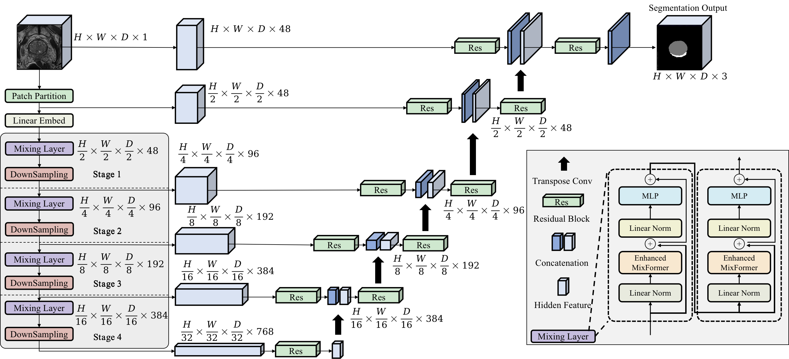
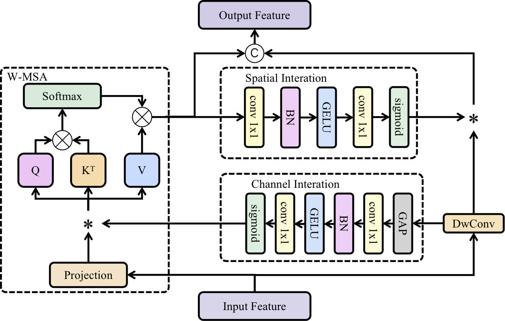

# What is MixUNETR？
MixUNETR is a novel deep learning architecture that combines the strengths of CNN and Transformer for prostate MRI image segmentation. MixUNETR utilizes the Enhanced MixFormer module to effectively improve the model's spatial and channel modeling capabilities, essential for accurately delineating the PZ and TZ of the prostate. Experimental results on the Prostate158, ProstateX, and Private datasets illustrate that MixUNETR achieves state-of-the-art segmentation accuracy while maintaining reasonable computational efficiency.


To enhance the channel modeling capability of MixFormer, we fuse the attention output of channel interaction with the value of W-MSA and additionally integrate the channel attention with query and key. Through this fusion approach, we are able to fully leverage the association between channel attention and query/key, further enhancing the model's ability to model channel information. This initiative enhances the channel modeling capability of W-MSA without inflating model parameters, effectively establishing long-range dependency relationships. 



# Installing Dependencies
The baseline has been trained with the following packages and versions:

```
MONAI version: 0.9.dev2149
PyTorch version: 1.9.1
PyTorch Ignite version: 0.4.7
Numpy version: 1.21.2
pandas version: 1.3.5
PyYAML version: 5.4.1
Munch version: 2.5.0
```
You should be able to install all dependencies with: `pip install -U "monai[all]" pyyaml munch pandas`

Additionally you should install OpenCV: `sudo apt update` and `sudo apt install libopencv-dev python3-opencv`


# Datasets
The following datasets were used for training.
- Prostate158 [link](https://github.com/kbressem/prostate158)
- ProstateX [link](https://aapm.org/GrandChallenge/PROSTATEx-2/)


# Training
Adapt the `data_dir`, the `train_csv`, `valid_csv` and `test_csv` file paths in the `anatomy.yaml`.
Then execute:  
```bash
python train.py --config config/prostate158/anatomy_mixunetr.yaml

```
This will launch a training session which should give similar results as in the paper. However, even with a random seed, results between runs my vary up to 1%.

Inside a jupyter notebook, training can be started with the following code:

```python
import monai
from prostate.utils import load_config
from prostate.train import SegmentationTrainer

config = load_config('config/prostate158/anatomy_mixunetr.yaml')
monai.utils.set_determinism(seed=config.seed)

trainer=SegmentationTrainer(
    config=config,
    progress_bar=True,
    early_stopping = True,
    metrics = ["MeanDice", "HausdorffDistance", "SurfaceDistance"],
    save_latest_metrics = True,
)

trainer.run()
```
If satisfied, evaluate the model on a new dataset.
```python
from prostate.data import segmentation_dataloaders
test_dl = segmentation_dataloaders(config=config, train=False, valid=False, test=True)
trainer.evaluate(
    checkpoint='models/NAME_OF_CHECKPOINT.pt',
    dataloader=test_dl
)
```

See also the [train.ipynb](train.ipynb) notebook for a more detailed tutorial.


# License
See the LICENSE file for details


# Citations

# References

